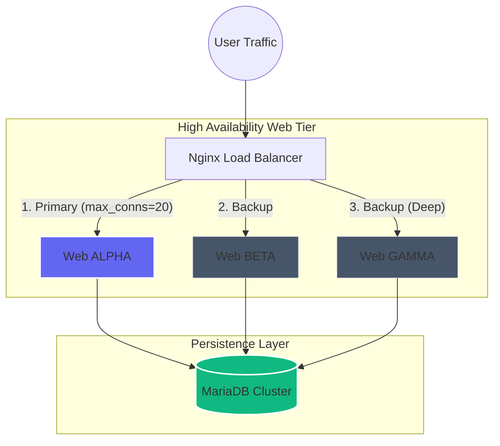

# 🏗️ Triple-Web-DB: Tiered Overflow Architecture

[](https://www.docker.com/)
[](https://www.python.org/)
[](https://mariadb.org/)
[](https://www.nginx.com/)

A professional, production-grade multi-tier infrastructure demonstrating **High-Availability (HA)** through a **Tiered Overflow** strategy. Built on Ubuntu and orchestrated with Docker Compose, this stack features automated load balancing, self-initializing persistent storage, and a premium administrative audit layer.

---

## 🛰️ Architecture Overview

The system implements a hierarchical traffic distribution model designed to handle bursty workloads by spilling over into redundant backup nodes.



---

## 🌟 Key Features

- **⚡ Tiered Overflow Strategy**: Traffic is prioritized to the **ALPHA** node. If connection limits are reached (simulating high CPU/Memory load), Nginx dynamically spills traffic to **BETA** and **GAMMA** nodes.
- **📦 Auto-Initializing Database**: The stack includes a `schema.sql` that automatically creates the `app_db` and `site_logins` tables on the first launch.
- **🎨 Premium UI/UX**: State-of-the-art Glassmorphic interfaces for both the user gateway and administrative audit logs, featuring mesh gradients and micro-animations.
- **📊 Infrastructure Observability**: Built-in `health_monitor.sh` script for real-time resource tracking and traffic route verification.
- **🔒 Environment Isolation**: Fully parameterized configuration via environment variables for easy deployment across staging and production.

---

## 🚀 Quick Start

1. **Clone and Initialize**:
   ```bash
   git clone https://github.com/ankitrout07/Triple-Web-Containerization-With-DB.git
   cd Triple-Web-Containerization-With-DB
   ```

2. **Launch Infrastructure**:
   ```bash
   docker compose up -d --build
   ```

3. **Verify Deployment**:
   - **Gateway**: [http://localhost](http://localhost)
   - **Audit Log**: [http://localhost/admin](http://localhost/admin)
   - **Monitor**: `./scripts/health_monitor.sh`

---

## 📂 Project Structure

```text
.
├── src/
│   └── web/            # Unified Flask Source & Template Engine
├── infrastructure/     # Service-specific configurations
│   ├── nginx/          # Load Balancer policies
│   └── mariadb/        # Automated DB Schema injection
├── scripts/            # DevOps Monitoring & Maintenance
├── docs/               # Technical notes & command references
└── docker-compose.yml  # Global orchestration manifest
```

---

## 🔧 Component Breakdown

### Web Service (`src/web`)
A modular Flask application that uses `os.environ` to dynamically adapt its identity (Alpha/Beta/Gamma) and database connection strings.

### Load Balancer (`infrastructure/nginx`)
Nginx is utilized as a reverse proxy with a custom `upstream` configuration:
```nginx
upstream myapp {
    server web1:80 max_conns=20;
    server web2:80 max_conns=20 backup;
    server web3:80 backup;
}
```

### Database Cluster (`infrastructure/mariadb`)
MariaDB 10.6 with persistent volume mounting for the `db_data` directory, ensuring no data loss between container restarts.

---

## 👥 Contributors & Contact

**Ankit Anupam Rout** - *Project Lead / DevOps Architect*
- GitHub: [@ankitrout07](https://github.com/ankitrout07)

---
*Generated with ❤️ by Antigravity*
